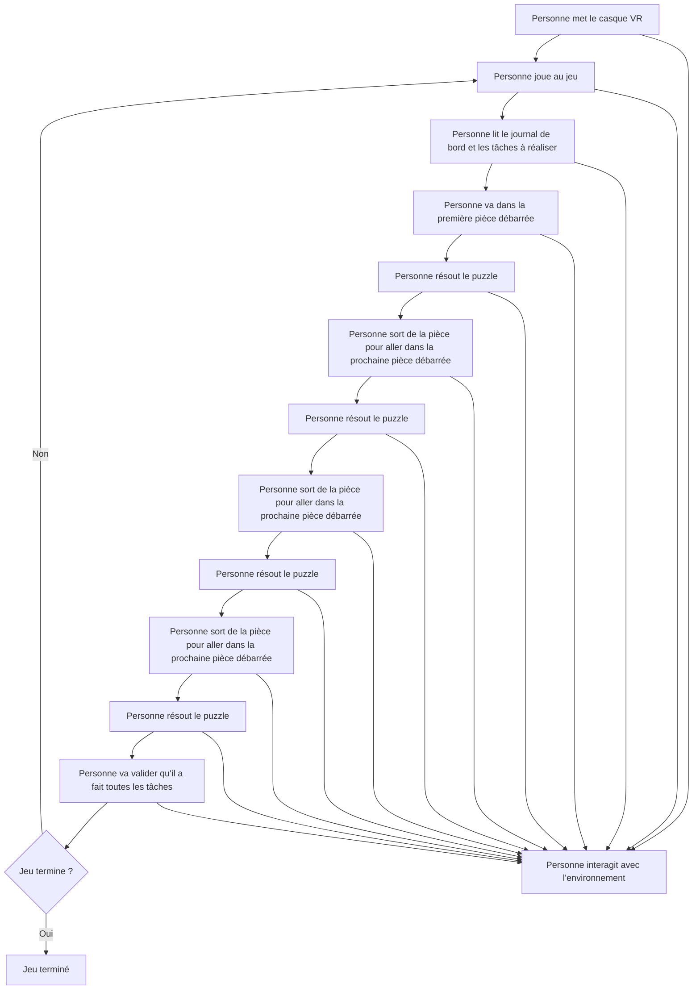

# Astronea

> En tant qu'astronaute, vous devez réparer la tour de communication de votre vaisseau pour demander de l'aide après que celui-ci aie mystérieusement cesser de fonctionner.

### Description

Plongez dans l'univers captivant Astronea, un jeu VR où vous incarnez un astronaute de la compagnie intergalactique StellarCorp. Envoyé sur une base spatiale pour étudier des astres mystérieux, votre mission prend une tournure inattendue lorsque votre vaisseau cesse mystérieusement de fonctionner.

Face à l'urgence, vous devez réparer la tour de communication afin de demander de l'aide. Explorez un environnement fascinant, rempli de technologies avancées et de paysages spatiaux éblouissants. Résolvez des énigmes complexes et interagissez avec des éléments de votre environnement pour restaurer le fonctionnement de votre vaisseau.

### Moodboard

#### Visuel

#### Sonore

Ambiances composées d'une basse synthétisée, de nappes de synthé et de leads de synthé.  
[lonnex - losing (slowed and reverb)](https://youtu.be/KZrvnPOu5oU?si=-EyvkCBBUJ0rWzIe)  
[lonnex - losing](https://youtu.be/BgBNLX_3afs?si=vbkmEJgLcy-1HkoC)  
[liminalyx - cold loneliness](https://youtu.be/xqp4gNT410s?si=xMWUA3M1ONo_CCdn)  
[cholosus - Dream](https://youtu.be/se5uNCrig18?si=1A6mLVT9Ko01AWEO)  
[SymphoCat - Long Whale Song](https://youtu.be/Glrwf8rKBXw?si=dz6L2nXC5B8sKCXO)  
[.diedlonely - avenoir](https://youtu.be/xF6Z8PdFbZQ?si=Gps7YuQKD7YOBPhE)  
[SymphoCat - Blue Whale](https://youtu.be/krSuui3nwqQ?si=G1x6yA_Nd2OJu_S9)  

### effet sonore
[prendre bouteille](https://pixabay.com/fr/sound-effects/bottle-clink-101000/)  

### Schéma d'interactivité

