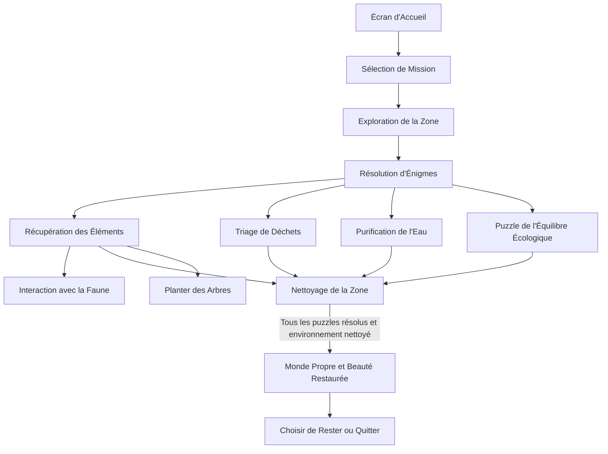

# Mission ÉcoEcho : Nettoyage Intergalactique

> En tant que membres d'une compagnie intergalactique de nettoyage vous avez pour mission de voyager à travers diverses planètes pour restaurer des écosystèmes pollués en résolvant des énigmes et en interagissant avec la faune locale.

### Description 
Les joueurs incarnent des agents d’une compagnie intergalactique de nettoyage, envoyés sur des planètes dévastées par la pollution et la dégradation écologique. Chaque mission les plonge dans des environnements variés.

Les joueurs utiliseront des technologies avancées pour nettoyer les zones contaminées, résoudre des énigmes environnementales et interagir avec la faune locale. En collectant des ressources et en réparant des habitats, ils apprendront l'importance de la durabilité et de la protection des écosystèmes.

Avec une ambiance immersive, des graphismes colorés et des mécaniques de jeu engageantes, cette expérience éducative sensibilisent les joueurs aux enjeux environnementaux tout en les invitant à participer activement à la protection de la nature, même au-delà de leur propre planète. 

### Moodboard
#### Visuel

#### Sonore

### Schéma d'interactivité

