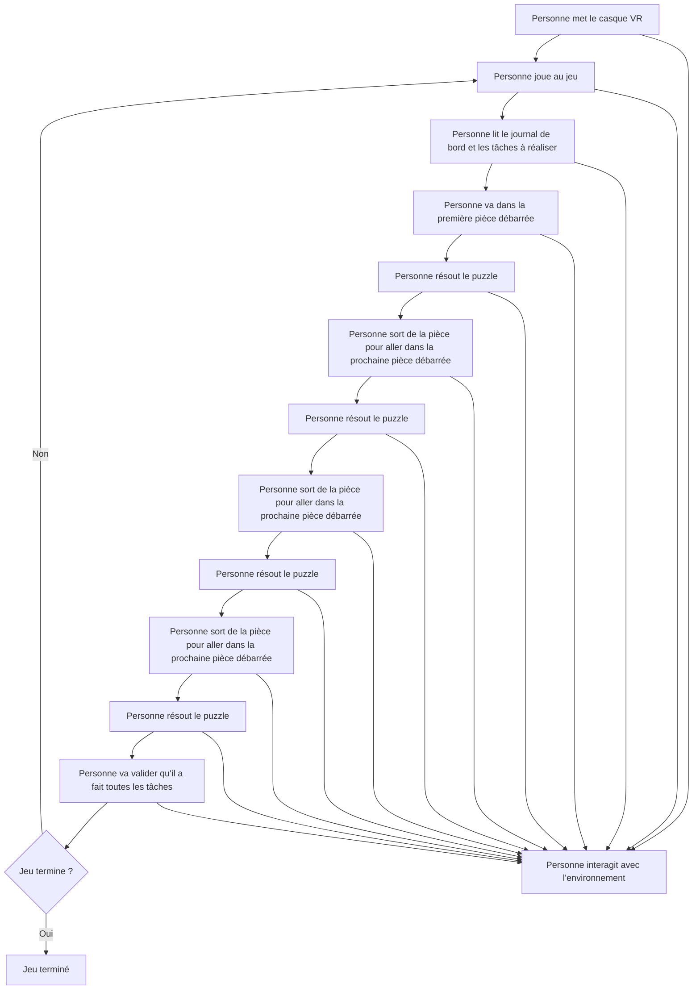

# Astronea

> Astronea est un jeu VR où vous incarnez un astronaute chargé de résoudre des puzzles et d'accomplir des tâches hebdomadaires pour étudier des plantes extraterrestres dans une base spatiale.

### Description

Astronea est un jeu immersif en réalité virtuelle qui place le joueur dans la peau d'un astronaute travaillant pour StellarCorp, une entreprise intergalactique spécialisée dans la recherche sur les plantes extraterrestres. Installé dans une base spatiale lointaine, le joueur doit accomplir des tâches hebdomadaires pour maintenir le progrès de ses recherches et poursuivre ses études botaniques.

Le jeu propose un environnement interactif où l'exploration de la base spatiale, l'analyse scientifique et l'observation des spécimens végétaux extraterrestres sont au cœur de l'expérience. Les plantes présentent des caractéristiques uniques et des comportements parfois surprenants, ce qui incite les joueurs à expérimenter, à documenter leurs observations et à découvrir les secrets de ces organismes fascinants.

Dans Astronea, les joueurs devront accomplir diverses tâches qui simulent la vie quotidienne d'un chercheur sur une base spatiale. Les missions incluent la réception et l'organisation de colis dans la pièce de rangement, l'entretien des plantes dans le "greenroom", et la réalisation d'expériences dans le laboratoire pour étudier les spécimens extraterrestres. En plus des tâches quotidiennes, les joueurs devront résoudre des puzzles liés à leurs activités de recherche. Chaque tâche présente des défis logiques et pratiques à surmonter : il peut s'agir de trouver la meilleure façon d'organiser les colis pour maximiser l'espace de rangement, de résoudre des énigmes pour optimiser les conditions de croissance des plantes dans le "greenroom", ou de déchiffrer des indices pour réussir les tests en laboratoire.

L'ambiance du jeu est joyeuse et décontractée, avec un style visuel cartoonish qui ajoute une touche de légèreté à l'environnement spatial. Les graphismes colorés et les animations ludiques rendent l'exploration agréable, tandis que les tâches variées offrent une expérience stimulante et amusante. Les joueurs interagissent avec des éléments excentriques et des gadgets futuristes, rendant les activités scientifiques dynamiques et engageantes.

### Moodboard

#### Visuel

#### Sonore

Ambiances composées d'une basse synthétisée, de nappes de synthé et de leads de synthé.  
[lonnex - losing (slowed and reverb)](https://youtu.be/KZrvnPOu5oU?si=-EyvkCBBUJ0rWzIe)  
[lonnex - losing](https://youtu.be/BgBNLX_3afs?si=vbkmEJgLcy-1HkoC)  
[liminalyx - cold loneliness](https://youtu.be/xqp4gNT410s?si=xMWUA3M1ONo_CCdn)  
[cholosus - Dream](https://youtu.be/se5uNCrig18?si=1A6mLVT9Ko01AWEO)  
[SymphoCat - Long Whale Song](https://youtu.be/Glrwf8rKBXw?si=dz6L2nXC5B8sKCXO)  
[.diedlonely - avenoir](https://youtu.be/xF6Z8PdFbZQ?si=Gps7YuQKD7YOBPhE)  
[SymphoCat - Blue Whale](https://youtu.be/krSuui3nwqQ?si=G1x6yA_Nd2OJu_S9)  

### effet sonore
[prendre bouteille](https://pixabay.com/fr/sound-effects/bottle-clink-101000/)  

### Schéma d'interactivité

